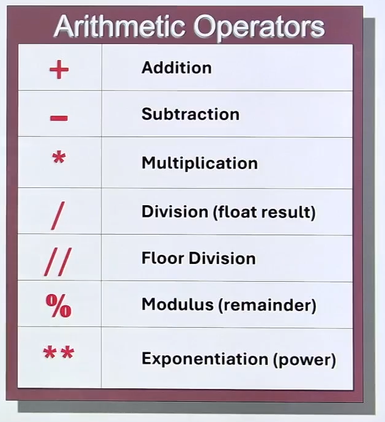
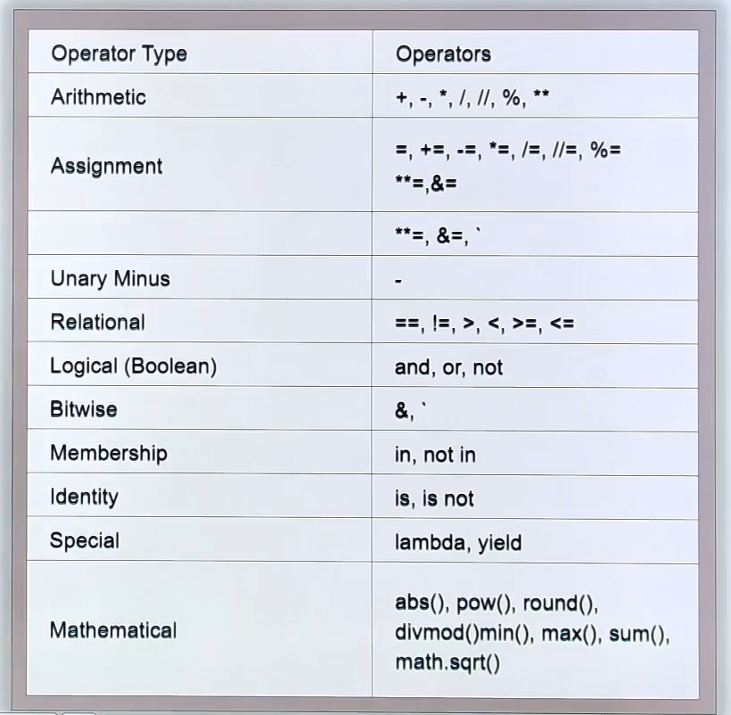
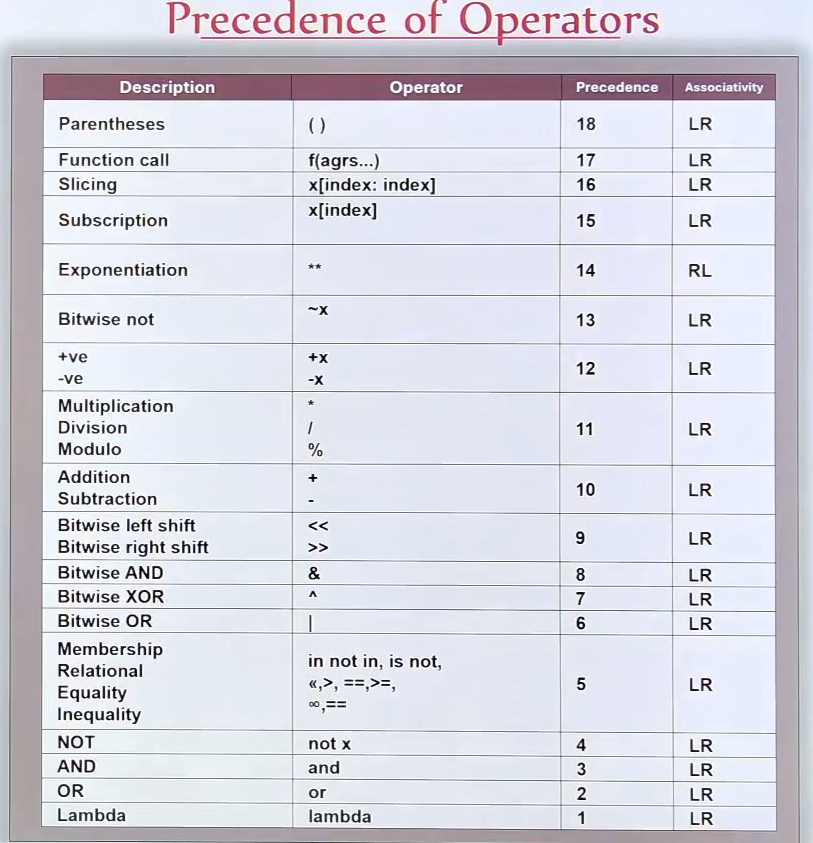

# Operators and Expressions in Python

## Overview
This document explores operators and expressions in Python, based on practice exercises and resources. It covers arithmetic operators, operator precedence, and practical applications like calculating areas. References include PDFs and images from the Resources folder for deeper insights.

### Key Concepts
- **Expression**: A combination of operands and operators, e.g., `c = a + b`.
- **Operands**: Values like variables or literals (a, b, c).
- **Operators**: Symbols performing operations (+, -, *, etc.).

## Arithmetic Operators

### Addition, Subtraction, and Multiplication
Basic operators for fundamental math.

```python
a = 14
b = 4
print(a, "+", b, "=", a + b)  # 14 + 4 = 18
print(a, "-", b, "=", a - b)  # 14 - 4 = 10
print(a, "*", b, "=", a * b)  # 14 * 4 = 56
```



**Reference**: See `27.+Arithmetic+Operators.pdf` and `Airthmatic Operators.png` for visuals.

### Division Operators
- `/` (Float Division): Returns quotient as float, even for integers.
- `//` (Floor Division): Returns integer quotient, discarding fractional part.
- `%` (Modulus): Returns remainder.

```python
print(a, "/", b, "=", a / b)   # 14 / 4 = 3.5
print(a, "//", b, "=", a // b) # 14 // 4 = 3
print(a, "%", b, "=", a % b)   # 14 % 4 = 2
```

**Note**: Unlike languages like Java/C, `/` always gives float.



**Reference**: `27.+Arithmetic+Operators.pdf` and `All Operators.png`.

### Exponentiation
`**` raises the base to the power of the exponent.

```python
print(2, "**", 5, "=", 2 ** 5)  # 2 ** 5 = 32
```

## Operator Precedence
Operators have precedence and associativity rules.

- Multiplication, division, modulus: Higher precedence than addition/subtraction.
- Exponentiation: Right-associative.
- Parentheses override precedence.

```python
print(2 + 3 * 4)        # 14 (multiplication first)
print((2 + 3) * 4)      # 20 (parentheses first)
print(2 ** 3 ** 2)      # 512 (3**2=9, then 2**9)
print(2 + 5 - 3 * 12 / 2 % 3)  # 4.0 (multiplication/division/modulus left-associative, then add/subtract)
print(2 + (5 - (3 * 12) / (2 % (3 ** 2))))  # -11.0 (exponentiation first, then modulus, etc.)
```



**Reference**: `Precendence Of Operator.png` and `28.+Expressions.pdf`.

## Practical Programs

### Area of a Rectangle
```python
length = 15
breadth = 5
area = length * breadth
print("Area of Rectangle is:", area)  # 75
```

### Area of a Circle
```python
radius = 7
pi = 3.14
area = pi * (radius ** 2)
print("Area of Circle is:", area)  # 153.86
```

### Area of a Rectangle with User Input
```python
length = int(input("Enter the length of the rectangle: "))
breadth = int(input("Enter the breadth of the rectangle: "))
area = length * breadth
print("Area of Rectangle is:", area)
```

**Reference**: `29.+Program+using+Expressions.pdf` and `31. Taking Input from Keyboard.pdf`.

## Resources
- **PDFs**:
  - `26.+Section+Intoduction.pdf`: Introduction to the section.
  - `27.+Arithmetic+Operators.pdf`: Details on arithmetic ops.
  - `28.+Expressions.pdf`: Expression concepts.
  - `29.+Program+using+Expressions.pdf`: Program examples.
  - `31. Taking Input from Keyboard.pdf`: Input handling.
- **Images**:
  - `Airthmatic Operators.png`
  - `All Operators.png`
  - `Precendence Of Operator.png`

## Best Practices
- Use parentheses for clarity in complex expressions.
- Test precedence with simple examples.
- Handle user input carefully (e.g., convert to int/float).

## References
- Based on the Jupyter notebook "Operators and Expressions.ipynb".
- Python docs: https://docs.python.org/3/reference/expressions.html
